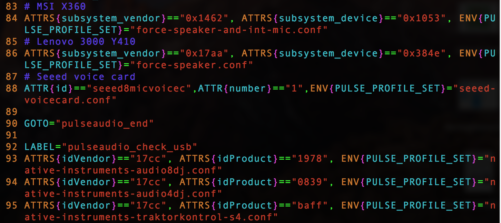

# PulseAudio Configuration for seeed-voicecard

Following this guide if you want to use your seeed-voicecard as a default source/sink of pulseaudio.

### ReSpeaker 4 Mic Array


1. Download pulseaudio
```
sudo apt install pulseaudio
```

2. First, you need to write [a profile for pulse](https://www.freedesktop.org/wiki/Software/PulseAudio/Backends/ALSA/Profiles/)
```
cd seeed-voicecard
cd pulseaudio
cd pulse_config_4mic
sudo cp seeed-voicecard.conf /usr/share/pulseaudio/alsa-mixer/profile-sets/
```

3. Edit `udev rules`

    During the system start, when the card "seeed4micvoicec" is detected, the PULSE_PROFILE_SET variable will be set in the udev database, and PulseAudio will be forced to use `seeed-voicecard.conf`. 

    ```
    # have a look at /lib/udev/rules.d/90-pulseaudio.rules
    sudo vim /lib/udev/rules.d/90-pulseaudio.rules
    # add the following lines at about line 87(behind the setting for some laptops and before the line GOTO="pulseaudio_end")
    # Seeed Voicecard
    ATTR{id}=="seeed4micvoicec",ATTR{number}=="1",ENV{PULSE_PROFILE_SET}="seeed-voicecard.conf"
    ```
    

    The value of `ATTR{number}` can be found with:

    ```
    udevadm info -a -p /sys/class/sound/card0/
    # or udevadm info -a -p /sys/class/sound/card1/
    ```

    For example, in Raspberry Pi, we can find `ATTR{id}=="seeed4micvoicec"` and `ATTR{number}=="1"` with command `udevadm info -a -p /sys/class/sound/card1/`:

    ```
    pi@raspberrypi:~ $ udevadm info -a -p  /sys/class/sound/card1/

    Udevadm info starts with the device specified by the devpath and then
    walks up the chain of parent devices. It prints for every device
    found, all possible attributes in the udev rules key format.
    A rule to match, can be composed by the attributes of the device
    and the attributes from one single parent device.

    looking at device '/devices/platform/soc/soc:sound/sound/card1':
        KERNEL=="card1"
        SUBSYSTEM=="sound"
        DRIVER==""
        ATTR{id}=="seeed4micvoicec"
        ATTR{number}=="1"

    looking at parent device '/devices/platform/soc/soc:sound':
        KERNELS=="soc:sound"
        SUBSYSTEMS=="platform"
        DRIVERS=="seeed-voicecard"
        ATTRS{driver_override}=="(null)"

    looking at parent device '/devices/platform/soc':
        KERNELS=="soc"
        SUBSYSTEMS=="platform"
        DRIVERS==""
        ATTRS{driver_override}=="(null)"

    looking at parent device '/devices/platform':
        KERNELS=="platform"
        SUBSYSTEMS==""
        DRIVERS==""
    ```

4. config `default.pa` and `daemon.conf`
```
sudo cp default.pa /etc/pulse/
sudo cp daemon.conf /etc/pulse/
```

5. reboot raspberry pi and check 
```
sudo reboot
pulseaudio --start  # start pulse at first
pactl info  # check the setting

Server String: /run/user/1000/pulse/native
Library Protocol Version: 32
Server Protocol Version: 32
Is Local: yes
Client Index: 18
Tile Size: 65496
User Name: pi
Host Name: raspberrypi
Server Name: pulseaudio
Server Version: 10.0
Default Sample Specification: s16le 4ch 96000Hz
Default Channel Map: front-left,front-center,front-right,rear-center
Default Sink: alsa_output.platform-soc_audio.analog-stereo
Default Source: alsa_input.platform-soc_sound.seeed-source
Cookie: 3b12:70b3
```

### 6-Mics Circular Array Kit and 4-Mics Linear Array


1. Download pulseaudio
```
sudo apt install pulseaudio
```

2. First, you need to write [a profile for pulse](https://www.freedesktop.org/wiki/Software/PulseAudio/Backends/ALSA/Profiles/)
```
cd seeed-voicecard
cd pulseaudio
cd pulse_config_6mic
sudo cp seeed-voicecard.conf /usr/share/pulseaudio/alsa-mixer/profile-sets/
```

3. Edit `udev rules`

    During the system start, when the card "seeed8micvoicec" is detected, the PULSE_PROFILE_SET variable will be set in the udev database, and PulseAudio will be forced to use `seeed-voicecard.conf`. 

    ```
    # have a look at /lib/udev/rules.d/90-pulseaudio.rules
    sudo vim /lib/udev/rules.d/90-pulseaudio.rules
    # add the following lines at about line 87(behind the setting for some laptops and before the line GOTO="pulseaudio_end")
    # Seeed Voicecard
    ATTR{id}=="seeed8micvoicec",ATTR{number}=="1",ENV{PULSE_PROFILE_SET}="seeed-voicecard.conf"
    ```
    

    The value of `ATTR{number}` can be found with:

    ```
    udevadm info -a -p /sys/class/sound/card0/
    # or udevadm info -a -p /sys/class/sound/card1/
    ```

    For example, in Raspberry Pi, we can find `ATTR{id}=="seeed8micvoicec"` and `ATTR{number}=="1"` with command `udevadm info -a -p /sys/class/sound/card1/`:

    ```
    pi@raspberrypi:~ $ udevadm info -a -p  /sys/class/sound/card1/

    Udevadm info starts with the device specified by the devpath and then
    walks up the chain of parent devices. It prints for every device
    found, all possible attributes in the udev rules key format.
    A rule to match, can be composed by the attributes of the device
    and the attributes from one single parent device.

    looking at device '/devices/platform/soc/soc:sound/sound/card1':
        KERNEL=="card1"
        SUBSYSTEM=="sound"
        DRIVER==""
        ATTR{id}=="seeed8micvoicec"
        ATTR{number}=="1"

    looking at parent device '/devices/platform/soc/soc:sound':
        KERNELS=="soc:sound"
        SUBSYSTEMS=="platform"
        DRIVERS=="seeed-voicecard"
        ATTRS{driver_override}=="(null)"

    looking at parent device '/devices/platform/soc':
        KERNELS=="soc"
        SUBSYSTEMS=="platform"
        DRIVERS==""
        ATTRS{driver_override}=="(null)"

    looking at parent device '/devices/platform':
        KERNELS=="platform"
        SUBSYSTEMS==""
        DRIVERS==""
    ```

4. config `default.pa` and `daemon.conf`
```
sudo cp default.pa /etc/pulse/
sudo cp daemon.conf /etc/pulse/
```

5. reboot raspberry pi and check 
```
sudo reboot
pulseaudio --start  # start pulse at first
pactl info  # check the setting

# The output should be like this
# You could see the default sink is seeed-2ch and default source is seeed-8ch
pi@raspberrypi:~ $ pactl info
Server String: /run/user/1000/pulse/native
Library Protocol Version: 32
Server Protocol Version: 32
Is Local: yes
Client Index: 6
Tile Size: 65496
User Name: pi
Host Name: raspberrypi
Server Name: pulseaudio
Server Version: 10.0
Default Sample Specification: s32le 8ch 96000Hz
Default Channel Map: front-left,front-left-of-center,front-center,front-right,front-right-of-center,rear-center,aux0,aux1
Default Sink: alsa_output.platform-soc_sound.seeed-2ch
Default Source: alsa_input.platform-soc_sound.seeed-8ch
Cookie: 3523:e5af
```

### FAQ

1. Default Sink/Source not right

    Make sure there is no any other daemon or using the audio device. Then check profile and udev rules.

    `pacmd list-sinks` and `pacmd list-sources` can be used to show the avaiable sinks/sources, after pulseaudio is started.

2. Can't start PulseAudio

    Check `default.pa` and `daemon.conf`

3. How to get PulseAudio started automatically

    Normally the PulseAudio server is started automatically. If you want to disable it, you can set `autospawn = no` in `~/.config/pulse/client.conf` or `/etc/pulse/client.conf`. 
    [Click this for more details](https://www.freedesktop.org/wiki/Software/PulseAudio/Documentation/User/Running/).

4. Why the default sample rate is 96000? What if my audio's sample rate is not the same as the default?

    For the other sample rate audio, PulseAudio will resample it into 96K, which means that if your audio's sample rate is lower than 96K, it will get smoothing.